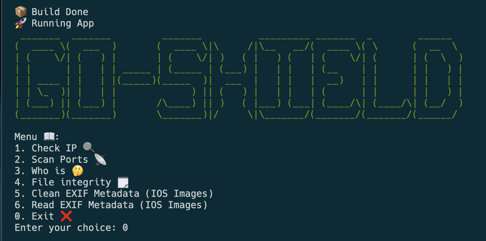

# Go Shield 🛡️

This tool is designed to compile various cybersecurity scripts that are commonly used for investigating potential SCAM pages in phishing emails. Its purpose is to enhance the efficiency and effectiveness of such investigations.

## Avaliable

- IP Check: Retrieve the IP address of a Host. 
- Port Scan: Scan the ports of a Host. 
- Whois Lookup: Obtain the Whois report of a Host. 
- File Integrity: 
    - Generate File Hash: Create a hash value for a File. 
    - Verify Hash and File: Validate if a Hash matches a File. 
- Metadata Manipulation: 
    - Clean EXIF Metadata (IOS Images): Remove EXIF tag data, such as location information added by IOS, from images. 
    - Read EXIF Metadata (IOS Images): Extract all EXIF data from an image.
- Password Generation: Generate a secure password using letters, numbers, and symbols by default 
- File Encryption: 
    - Encrypt File: Generate an encrypted file along with a password for decryption. 
    - Decrypt File: Decrypt a file using the provided password.